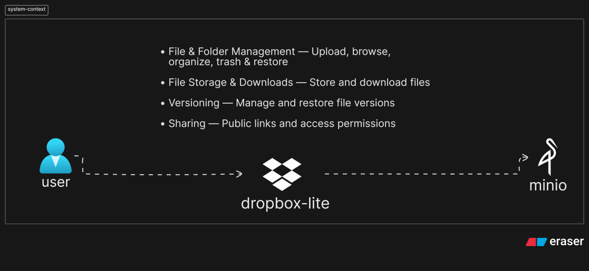

# 🧊 Dropbox Lite

A production-style, Dropbox-like file storage and sharing platform — Spring Boot microservices on the backend, React on the frontend. Built for a hackathon.

## 🔴 Live

| Service | URL |
|---|---|
| UI | http://dropbox.34-14-138-43.nip.io |
| Swagger / OpenAPI | http://dropbox.34-14-138-43.nip.io/swagger-ui.html (aggregates all services) |

## Overview

Six independently deployable services, each owning its own PostgreSQL database and talking over REST and Kafka. File bytes live in MinIO; Redis backs caching, locks, and rate-limiting.

- Account
- Metadata
- Upload
- Download
- API Gateway
- Async Worker

**Stack:** Java 21 · Spring Boot · Spring Cloud Gateway · PostgreSQL · Redis · Kafka · MinIO · Docker · Kubernetes (GKE) · React + Vite + TypeScript

## Patterns

| Pattern | Where |
|---|---|
| Idempotency | Upload session creation — `Idempotency-Key` header + unique constraint (`upload-service/.../IdempotencyKey.java`) |
| Outbox | Lifecycle events written in the same DB transaction as the change, published by a poller (`upload-service` & `metadata-service`, `OutboxEvent.java` / `OutboxPublisher.java`) |
| Retry + DLT | Kafka consumers retry with fixed backoff (2s/10s/30s) before routing to a dead-letter topic — every consumer, across `account-service`, `metadata-service`, and `async-worker` (`.../config/KafkaConsumerConfig.java`) |
| Caching | Redis cache-aside for file/folder metadata, PostgreSQL as source of truth (`metadata-service/.../RedisCacheService.java`) |
| Rate limiting | Redis token-bucket per route at the gateway (`api-gateway/application.yaml`, `RequestRateLimiter`) |
| Distributed locking | Redis lock around upload completion and version creation (`upload-service/.../RedisLockService.java`) |

## Architecture & Docs

[](docs/ARCHITECTURE.md)

| Doc | What's in it |
|---|---|
| [Architecture](docs/ARCHITECTURE.md) | System context → containers → business flows → per-service ERDs (SVGs) |
| [Design Trade-offs](docs/DESIGN_TRADE_OFFS.md) | Scaling, failure handling, and consistency trade-offs |
| [Technical Design](docs/claude/TECHNICAL_DESIGN.md) | Full architecture, APIs, DB schema, Kafka/Outbox design |
| [Postman Collection](docs/postman/Dropbox-Lite.postman_collection.json) | Ready-to-import API requests |

## Run Locally

```bash
cp .env.example .env
docker compose up -d          # postgres, redis, kafka, minio

# each service (separate terminals), from its own directory:
./mvnw spring-boot:run         # account-service   -> :8081
./mvnw spring-boot:run         # metadata-service  -> :8082
./mvnw spring-boot:run         # upload-service    -> :8083
./mvnw spring-boot:run         # download-service  -> :8084
./mvnw spring-boot:run         # api-gateway       -> :8080
./mvnw spring-boot:run         # async-worker      -> :8085

cd dropbox-ui && npm install && npm run dev   # UI -> http://localhost:5173
```

Gateway on `:8080` fronts everything — API at `/api/**`, Swagger at `/swagger-ui.html`. `discovery-service` (Eureka) is platform infra, not required for services to talk to each other locally.
