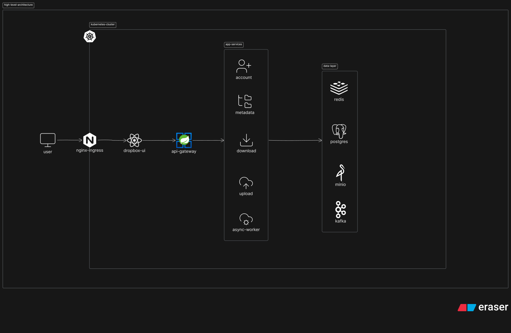
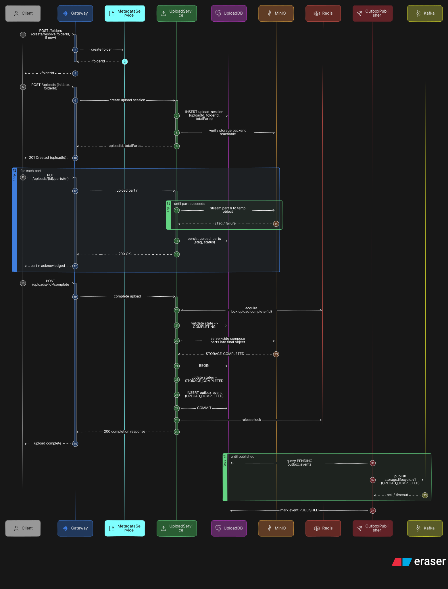
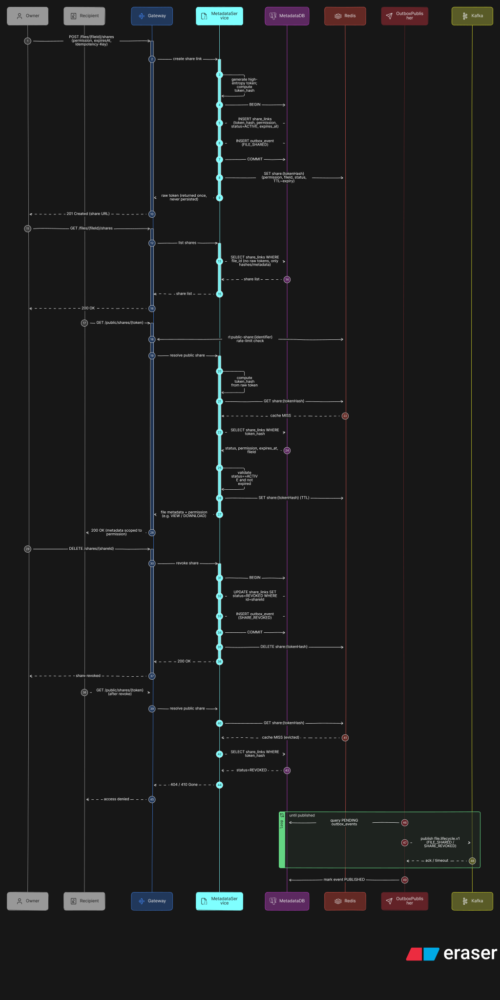
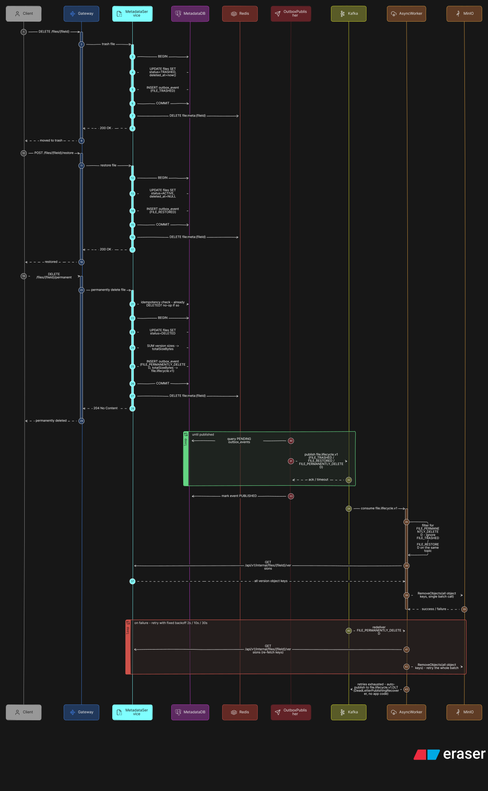
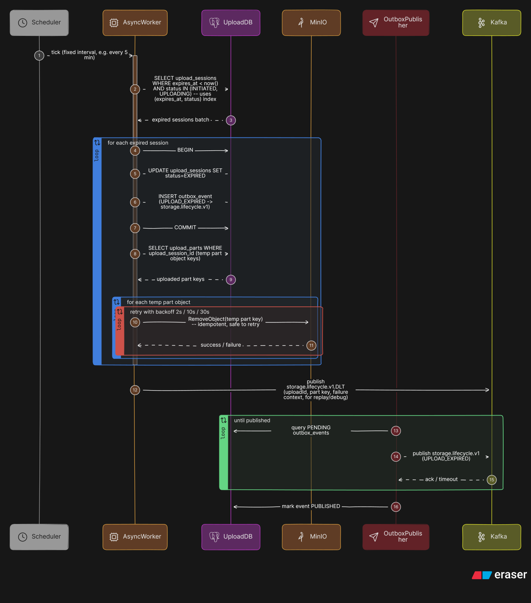
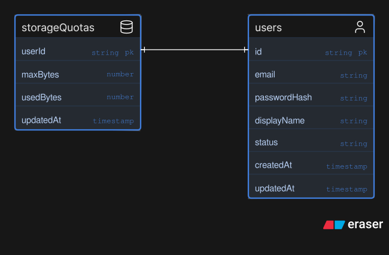
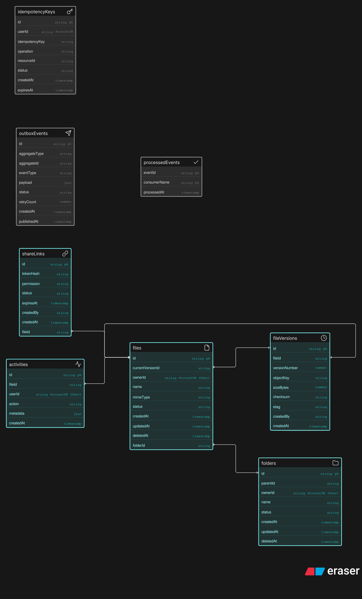
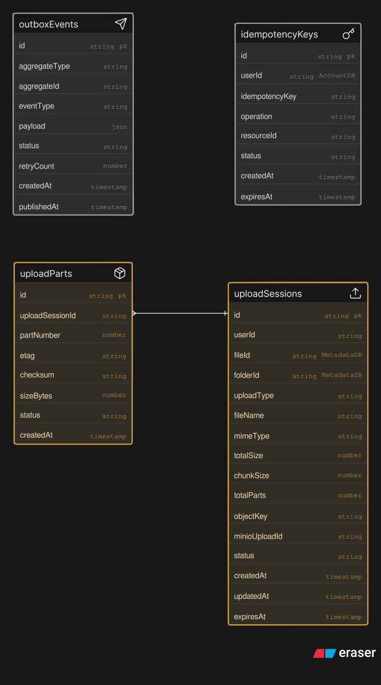

# Architecture

Four levels of depth — system context down to per-service schema.

---

## System Context

---

## Microservice Containers

---

## Core Business Flows

### Upload

### File Browsing & Download

### File Versioning

### File Sharing

### File Lifecycle

### Background Upload Cleanup

---

## Database ERDs

### Account DB

### Metadata DB

### Upload DB

